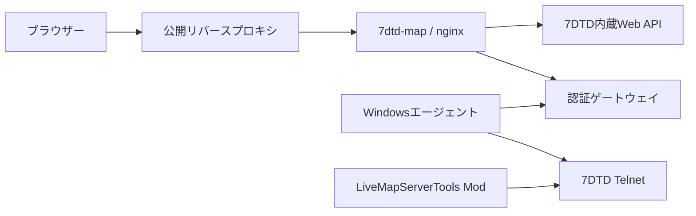

# 7DTD Live Map

7 Days to Die Dedicated Serverが生成する探索済み地図を、必要なAPIだけに絞って公開するセルフホスト型Webマップです。

プレイヤー位置、車両、トレーダー、寝袋、クエスト、全員共有ウェイポイント、バイオーム、サーバー状態、絞り込み済み履歴を合い言葉認証後に表示できます。任意の管理コマンドをWebから実行する機能はありません。

> [!IMPORTANT]
> 本プロジェクトは非公式であり、The Fun Pimpsおよび7 Days to Dieとは提携していません。ゲーム本体、ゲーム素材、ワールド、地図タイルは含みません。

## 特徴

- 7DTD内蔵Web APIの許可リスト型nginxプロキシ
- Leafletによる探索済み地図表示とタイルキャッシュ
- PBKDF2-HMAC-SHA256を使った共有合い言葉認証
- 1時間に5回失敗した接続元を24時間ブロック
- IP、プラットフォームID、インベントリを保存しないプレイヤースナップショット
- チャット、参加、退出、死亡だけを保持するサーバー履歴
- Windowsエージェントによる10秒間隔の安全なデータ収集
- 読み取り専用コマンドと全員共有地点を提供するサーバー側Mod
- 既定OFFの5分遅延再起動予約

## 構成



公開nginxは地図設定、ゲーム内時刻、地図PNGと本プロジェクトの絞り込み済みAPIだけを中継します。7DTDの標準ダッシュボード、セッション、生ログ、汎用コマンドAPIは公開しません。

## 対応環境

- 7 Days to Die Dedicated Server V3系
- ゲームサーバー: Windows
- 公開フロントエンド: Docker Composeが利用できるLinux
- 既存の`nginx-proxy`互換ネットワーク

初期公開版はV3.0.1で検証しています。7DTDのアップデートで内部APIやMod APIが変わる可能性があります。

## 1. 7DTDの準備

`serverconfig.xml`で内蔵Web Dashboardと地図レンダリングを有効化します。

```xml
<property name="WebDashboardEnabled" value="true"/>
<property name="WebDashboardPort" value="8080"/>
<property name="EnableMapRendering" value="true"/>
```

`serveradmin.xml`には用途を分離したAPIトークンを作成してください。

- `map-player-reader`: プレイヤー参照専用
- `map-activity-reader`: ログ参照専用

地図画像を認証なしで取得させる場合も、`web.map`以外の権限を緩めないでください。7DTD内蔵Webポートはインターネットへ直接公開せず、Dockerホストからだけ到達可能にします。

## 2. 公開側の設定

```sh
git clone https://github.com/winpower316/7dtd-live-map.git
cd 7dtd-live-map
cp .env.example .env
```

`.env`の次の値を自分の環境に合わせます。

- `PUBLIC_HOST`
- `LETSENCRYPT_EMAIL`
- `PUBLIC_NETWORK_NAME`
- `SEVEN_DAYS_HOST`
- `AGENT_BIND_IP`

`AGENT_BIND_IP`をLANアドレスにする場合は、Windowsゲームサーバー以外から接続できないようホストFWでも制限してください。

`.env.example`には、次の調整値も既定値つきでまとめています。

- 認証失敗回数、ブロック時間、履歴保持期間・件数
- 再起動予約の遅延・クールダウン
- ブラウザーの各更新間隔、地図タイル、再試行、車両追跡判定
- nginxのレート制限、キャッシュ容量・期間、タイムアウト
- Gatewayが受け付けるリクエスト、エンティティ、プレイヤーの安全上限

変更後は`docker compose config`で展開結果を確認し、次のコマンドでコンテナを再作成します。

```sh
docker compose up -d --build --force-recreate
```

`MAX_REQUEST_BODY_BYTES`などの安全上限やnginxのレート制限を大きくする場合は、公開ホストのメモリと7DTD内蔵Web APIへの負荷も確認してください。

### Secretの作成

```sh
mkdir -p secrets
openssl rand -hex 32 > secrets/restart-agent.token
```

`player-api.token`と`activity-api.token`には、7DTD側で作成した各APIトークンのsecretだけを書きます。末尾改行はあっても構いません。

合い言葉ハッシュは実機上で生成します。

```sh
docker compose build player-auth
printf '%s' 'CHANGE-THIS-PASSPHRASE' |
  docker run --rm -i --entrypoint python \
  local/7dtd-player-auth:latest /app/generate_password_hash.py \
  > secrets/player-map.password-hash
chmod 400 secrets/*
```

平文の合い言葉、トークン、生成済みハッシュをGitへ追加しないでください。

### 起動

```sh
docker compose up -d --build
docker compose ps
docker compose logs --tail=100
```

既存の`nginx-proxy`を使わない場合は、`7dtd-map`コンテナの8080番を自分のHTTPSリバースプロキシへ接続してください。

## 3. Modのビルド

ゲームサーバーで次を実行します。

```powershell
dotnet build .\mod\LiveMapServerTools.csproj -c Release `
  -p:GameManagedPath='C:\Program Files (x86)\Steam\steamapps\common\7 Days To Die\7DaysToDieServer_Data\Managed'
```

次のファイルを`Mods\LiveMapServerTools`へ配置します。

- `mod/ModInfo.xml`
- `mod/bin/Release/net48/LiveMapServerTools.dll`
- 任意: `mod/config.example.json`を`config.json`へコピー

`config.json`では、全員共有ウェイポイントの保持上限を変更できます。指定可能な範囲は1～5000件で、未配置時は200件です。

Modの読み込みにはゲームサーバーの再起動が必要です。

## 4. Windowsエージェント

Docker側の`secrets/restart-agent.token`と同じ値を、ゲームサーバーの次の場所へ保存します。

```text
C:\ProgramData\7dtd-web-restart\agent.token
```

ファイルACLは実行ユーザー、`SYSTEM`、ローカルAdministratorsだけに制限してください。

まず再起動機能なしで1回実行し、設定を確認します。

```powershell
.\windows-agent\7dtd-live-map-agent.ps1 `
  -ApiBase 'http://DOCKER_HOST_LAN_IP:18081' `
  -GameRoot 'C:\Program Files (x86)\Steam\steamapps\common\7 Days To Die' `
  -Once
```

繰り返し指定する値は、サンプルをコピーしたPowerShellデータファイルへ保存できます。

```powershell
Copy-Item .\windows-agent\config.example.psd1 `
  C:\ProgramData\7dtd-web-map\agent-config.psd1
.\windows-agent\7dtd-live-map-agent.ps1 `
  -ConfigPath C:\ProgramData\7dtd-web-map\agent-config.psd1 `
  -Once
```

コマンドラインで同じ引数を指定した場合は、設定ファイルよりコマンドラインを優先します。設定ファイルにはトークンそのものではなく`TokenPath`だけを記載してください。

継続運転には、ログオン状態に依存しない専用ユーザーまたは適切な権限のWindowsタスクを使用します。エージェントは次をゲートウェイへ送信します。

- 実行中バージョン
- 日長とブラッドムーン設定
- プレイヤーの絞り込み済みスナップショット
- 車両、補給物資、ドローン、トレーダー、寝袋、クエスト、共有地点
- バイオームPNG
- FPS、メモリ、エンティティ数などの統計

平日・休日など独自モード名を使う場合は`-ScheduleMode`、実効日長を上書きする場合は`-DayNightLengthMinutes`を指定します。

## 再起動予約を有効にする

再起動機能は既定で無効です。データ収集だけなら有効化しないでください。

有効化する場合は、次をすべて満たしてください。

1. `.env`の`RESTART_ENABLED=true`
2. エージェントへ`-EnableRestart`
3. `-StartShortcut`へ正常起動できるショートカットを指定
4. 定期メンテナンスと競合する場合は`-MaintenanceTaskName`を指定
5. 実プレイヤーがいない保守時間帯に停止・起動・Steamログオン確認まで試験

例:

```powershell
.\windows-agent\7dtd-live-map-agent.ps1 `
  -ApiBase 'http://DOCKER_HOST_LAN_IP:18081' `
  -EnableRestart `
  -StartShortcut 'C:\7dtd-server\startdedicated.bat.lnk' `
  -MaintenanceTaskName '7dtd-maintenance'
```

## 検証

```powershell
python -m unittest discover -s player-auth -p "test_*.py" -v
python scripts/check_public_tree.py
python scripts/check_config_surface.py
```

デプロイ後は少なくとも次を確認してください。

- 公開トップ、`/api/map/config`、探索済みPNGタイルが200
- `/api/features`が期待した再起動設定を返す
- 未認証の個人系APIが401
- 7DTDの`/api/log`、`/api/command`、標準ダッシュボードが公開URLでは404
- 認証後レスポンスにIP、プラットフォームID、インベントリがない
- 両コンテナがhealthy

## ライセンスと第三者ソフトウェア

本プロジェクト独自のコードは[MIT License](LICENSE)です。同梱しているLeafletはBSD-2-Clause Licenseで、ライセンス本文は`site/assets/LEAFLET-LICENSE.txt`にあります。

ゲーム本体、ゲーム素材、ワールドデータ、地図タイルはライセンス対象にも配布物にも含みません。Modの公開・再配布時はThe Fun Pimpsの最新ポリシーとゲームのEULAも確認してください。
